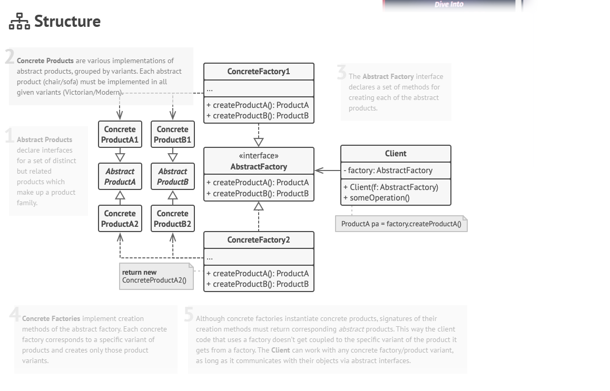
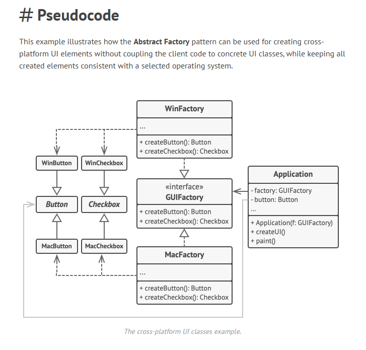

https://refactoring.guru/design-patterns/abstract-factory

# Abstract Factory is a creational design pattern that lets you produce families of related objects without specifying their concrete classes.

# Use cases

 Use the Abstract Factory when your code needs to work with various families of related products, but you don’t want it to depend on the concrete classes of those products—they might be unknown beforehand or you simply want to allow for future extensibility.

 The Abstract Factory provides you with an interface for creating objects from each class of the product family. As long as your code creates objects via this interface, you don’t have to worry about creating the wrong variant of a product which doesn’t match the products already created by your app.

 Consider implementing the Abstract Factory when you have a class with a set of Factory Methods that blur its primary responsibility.

 In a well-designed program each class is responsible only for one thing. When a class deals with multiple product types, it may be worth extracting its factory methods into a stand-alone factory class or a full-blown Abstract Factory implementation.