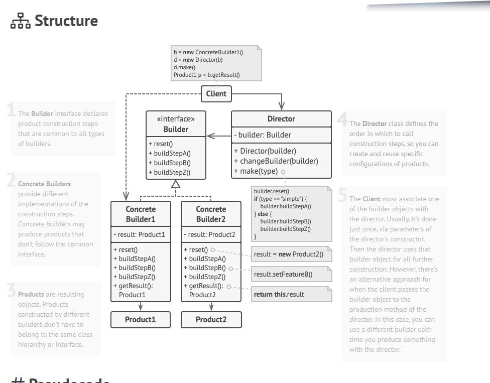

https://refactoring.guru/design-patterns/builder

# Builder is a creational design pattern that lets you construct complex objects step by step. The pattern allows you to produce different types and representations of an object using the same construction code.

# Applicability
 Use the Builder pattern to get rid of a “telescoping constructor”.

 Say you have a constructor with ten optional parameters. Calling such a beast is very inconvenient; therefore, you overload the constructor and create several shorter versions with fewer parameters. These constructors still refer to the main one, passing some default values into any omitted parameters.

class Pizza {
    Pizza(int size) { ... }
    Pizza(int size, boolean cheese) { ... }
    Pizza(int size, boolean cheese, boolean pepperoni) { ... }
    // ...
Creating such a monster is only possible in languages that support method overloading, such as C# or Java.

The Builder pattern lets you build objects step by step, using only those steps that you really need. After implementing the pattern, you don’t have to cram dozens of parameters into your constructors anymore.

 Use the Builder pattern when you want your code to be able to create different representations of some product (for example, stone and wooden houses).

 The Builder pattern can be applied when construction of various representations of the product involves similar steps that differ only in the details.

The base builder interface defines all possible construction steps, and concrete builders implement these steps to construct particular representations of the product. Meanwhile, the director class guides the order of construction.

 Use the Builder to construct Composite trees or other complex objects.

 The Builder pattern lets you construct products step-by-step. You could defer execution of some steps without breaking the final product. You can even call steps recursively, which comes in handy when you need to build an object tree.

A builder doesn’t expose the unfinished product while running construction steps. This prevents the client code from fetching an incomplete result.